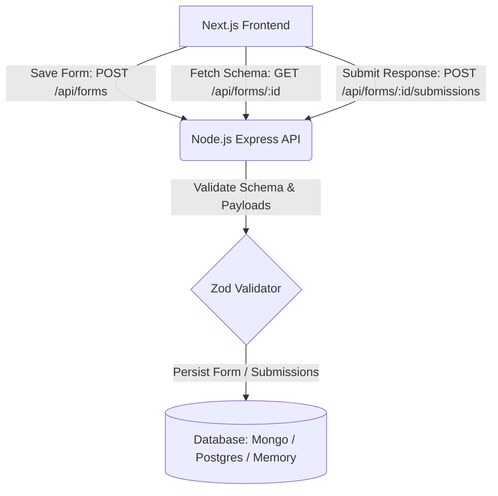

# Backend Implementation Guide: Node.js + dynamic-form-builder-kit

This guide provides a clean, production-grade, step-by-step walkthrough for implementing a **Node.js REST API backend** for **`dynamic-form-builder-kit`**.

The backend is responsible for:
1. **Storing and updating form schemas** generated by the `<FormBuilder />` component.
2. **Serving form schemas** to both the builder and the public form renderer.
3. **Validating and recording incoming form responses** submitted by end users.

---

## 📑 Table of Contents

1. [Architecture & Endpoints Overview](#1-architecture--endpoints-overview)
2. [Step 1: Node.js & TypeScript Project Setup](#step-1-nodejs--typescript-project-setup)
3. [Step 2: Shared Types from dynamic-form-builder-kit](#step-2-shared-types-from-dynamic-form-builder-kit)
4. [Step 3: Schema Validation with Zod](#step-3-schema-validation-with-zod)
5. [Step 4: Database & Storage Layer Options](#step-4-database--storage-layer-options)
   - [Option A: In-Memory Store (Instant Zero-Setup Testing)](#option-a-in-memory-store-instant-zero-setup-testing)
   - [Option B: MongoDB & Mongoose](#option-b-mongodb--mongoose)
   - [Option C: PostgreSQL / SQLite with Prisma](#option-c-postgresql--sqlite-with-prisma)
6. [Step 5: Controllers & Business Logic](#step-5-controllers--business-logic)
7. [Step 6: Express App & Server Configuration](#step-6-express-app--server-configuration)
8. [Step 7: Standalone Zero-Dependency Script (`server.js`)](#step-7-standalone-zero-dependency-script-serverjs)
9. [Step 8: Testing with cURL / Postman](#step-8-testing-with-curl--postman)
10. [Production & Security Best Practices](#production--security-best-practices)

---

## 1. Architecture & Endpoints Overview

The backend exposes a standard REST API consumed by your Next.js application:

| Method | Endpoint | Description | Request Body | Response |
|--------|----------|-------------|--------------|----------|
| `GET` | `/api/forms` | List all saved forms | None | `FormSummary[]` |
| `POST` | `/api/forms` | Create a new form schema | `FormPayload` | `FormDocument` |
| `GET` | `/api/forms/:id` | Get form schema by ID | None | `FormDocument` |
| `PUT` | `/api/forms/:id` | Update existing form schema | `FormPayload` | `FormDocument` |
| `DELETE` | `/api/forms/:id` | Delete a form and its submissions | None | `{ success: true }` |
| `POST` | `/api/forms/:id/submissions` | Submit end-user responses | `Record<string, any>` | `{ id, success: true }` |
| `GET` | `/api/forms/:id/submissions` | Get submissions for a form | None | `FormSubmission[]` |



---

## Step 1: Node.js & TypeScript Project Setup

Create a new directory for your backend (or set this up inside your monorepo):

```bash
mkdir form-builder-backend
cd form-builder-backend
npm init -y
```

### Install Dependencies
```bash
# Core framework & utilities
npm install express cors dotenv zod uuid

# dynamic-form-builder-kit (for shared types)
npm install dynamic-form-builder-kit

# TypeScript & Development Tools
npm install -D typescript tsx @types/express @types/cors @types/node @types/uuid
```

### Initialize TypeScript Configuration
Create `tsconfig.json`:
```json
{
  "compilerOptions": {
    "target": "ES2022",
    "module": "NodeNext",
    "moduleResolution": "NodeNext",
    "lib": ["ES2022"],
    "outDir": "./dist",
    "rootDir": "./src",
    "strict": true,
    "esModuleInterop": true,
    "skipLibCheck": true,
    "forceConsistentCasingInFileNames": true
  },
  "include": ["src/**/*"]
}
```

Update your `package.json` scripts:
```json
"scripts": {
  "dev": "tsx watch src/server.ts",
  "build": "tsc",
  "start": "node dist/server.js"
}
```

---

## Step 2: Shared Types from dynamic-form-builder-kit

`dynamic-form-builder-kit` exports pure TypeScript interfaces without requiring React in your backend runtime:

```typescript
import type {
  FormPayload,
  FormContent,
  FormContentField,
  FormRow,
  FormFieldType,
} from 'dynamic-form-builder-kit';
```

Let's define the backend domain types in **`src/types/form.types.ts`**:

```typescript
import type { FormContent } from 'dynamic-form-builder-kit';

export interface FormDocument {
  id: string;
  title: string;
  content: FormContent;
  createdAt: Date;
  updatedAt: Date;
}

export interface FormSubmissionDocument {
  id: string;
  formId: string;
  data: Record<string, unknown>;
  createdAt: Date;
}
```

---

## Step 3: Schema Validation with Zod

Create **`src/schemas/form.schema.ts`** to strictly validate incoming payloads before they hit your database:

```typescript
import { z } from 'zod';

// Validate field definitions inside form content
export const FormContentFieldSchema = z.object({
  id: z.string().min(1),
  type: z.string().min(1),
  name: z.string().optional(),
  label: z.string().min(1),
  placeholder: z.string().optional(),
  required: z.boolean().optional(),
  columnWidth: z.enum(['full', 'half', 'third', 'quarter']).optional(),
  rowId: z.string().min(1),
  options: z.array(z.string()).optional(),
  rows: z.number().optional(),
  minValue: z.number().optional(),
  maxValue: z.number().optional(),
  step: z.number().optional(),
  accept: z.string().optional(),
  helpText: z.string().optional(),
  orientation: z.enum(['horizontal', 'vertical']).optional(),
  isDefault: z.boolean().optional(),
  isDefaultRequired: z.boolean().optional(),
});

// Validate row layout definitions
export const FormRowSchema = z.object({
  id: z.string().min(1),
  fields: z.array(z.string()),
});

// Validate the complete FormPayload sent from <FormBuilder onSave={...} />
export const CreateFormPayloadSchema = z.object({
  title: z.string().min(1, 'Form title is required').max(200),
  content: z.object({
    fields: z.array(FormContentFieldSchema),
    rows: z.array(FormRowSchema),
  }),
});

// Validate submission data
export const CreateSubmissionSchema = z.record(z.string(), z.any());
```

---

## Step 4: Database & Storage Layer Options

### Option A: In-Memory Store (Instant Zero-Setup Testing)

Ideal for local testing, rapid prototyping, and automated tests.

Create **`src/services/storage.service.ts`**:

```typescript
import { v4 as uuidv4 } from 'uuid';
import type { FormPayload } from 'dynamic-form-builder-kit';
import type { FormDocument, FormSubmissionDocument } from '../types/form.types.js';

class InMemoryFormStore {
  private forms = new Map<string, FormDocument>();
  private submissions = new Map<string, FormSubmissionDocument[]>();

  constructor() {
    // Seed with a sample form for convenience
    const sampleId = 'sample-feedback-form';
    this.forms.set(sampleId, {
      id: sampleId,
      title: 'Customer Feedback Form',
      content: {
        fields: [
          {
            id: 'field-1',
            type: 'text',
            name: 'full_name',
            label: 'Full Name',
            placeholder: 'John Doe',
            required: true,
            rowId: 'row-1',
            columnWidth: 'half',
          },
          {
            id: 'field-2',
            type: 'email',
            name: 'email',
            label: 'Email Address',
            placeholder: 'john@example.com',
            required: true,
            rowId: 'row-1',
            columnWidth: 'half',
          },
          {
            id: 'field-3',
            type: 'textarea',
            name: 'feedback',
            label: 'Your Feedback',
            placeholder: 'Tell us how we can improve...',
            required: true,
            rowId: 'row-2',
            columnWidth: 'full',
            rows: 4,
          },
        ],
        rows: [
          { id: 'row-1', fields: ['field-1', 'field-2'] },
          { id: 'row-2', fields: ['field-3'] },
        ],
      },
      createdAt: new Date(),
      updatedAt: new Date(),
    });
  }

  async getAllForms(): Promise<FormDocument[]> {
    return Array.from(this.forms.values()).sort(
      (a, b) => b.createdAt.getTime() - a.createdAt.getTime(),
    );
  }

  async getFormById(id: string): Promise<FormDocument | null> {
    return this.forms.get(id) || null;
  }

  async createForm(payload: FormPayload): Promise<FormDocument> {
    const id = uuidv4();
    const doc: FormDocument = {
      id,
      title: payload.title || 'Untitled Form',
      content: payload.content,
      createdAt: new Date(),
      updatedAt: new Date(),
    };
    this.forms.set(id, doc);
    return doc;
  }

  async updateForm(id: string, payload: FormPayload): Promise<FormDocument | null> {
    const existing = this.forms.get(id);
    if (!existing) return null;

    const updated: FormDocument = {
      ...existing,
      title: payload.title || existing.title,
      content: payload.content,
      updatedAt: new Date(),
    };
    this.forms.set(id, updated);
    return updated;
  }

  async deleteForm(id: string): Promise<boolean> {
    this.submissions.delete(id);
    return this.forms.delete(id);
  }

  async addSubmission(formId: string, data: Record<string, unknown>): Promise<FormSubmissionDocument> {
    const submission: FormSubmissionDocument = {
      id: uuidv4(),
      formId,
      data,
      createdAt: new Date(),
    };

    const existing = this.submissions.get(formId) || [];
    existing.unshift(submission);
    this.submissions.set(formId, existing);
    return submission;
  }

  async getSubmissionsByFormId(formId: string): Promise<FormSubmissionDocument[]> {
    return this.submissions.get(formId) || [];
  }
}

export const formStore = new InMemoryFormStore();
```

---

### Option B: MongoDB & Mongoose

If using MongoDB, install `mongoose`:
```bash
npm install mongoose
```

Create **`src/models/Form.model.ts`**:
```typescript
import mongoose, { Schema, Document } from 'mongoose';
import type { FormContent } from 'dynamic-form-builder-kit';

export interface IForm extends Document {
  title: string;
  content: FormContent;
  createdAt: Date;
  updatedAt: Date;
}

const FormSchema = new Schema<IForm>(
  {
    title: { type: String, required: true, trim: true },
    content: {
      fields: { type: [Schema.Types.Mixed], default: [] },
      rows: { type: [Schema.Types.Mixed], default: [] },
    },
  },
  { timestamps: true },
);

export const FormModel = mongoose.model<IForm>('Form', FormSchema);

const FormSubmissionSchema = new Schema(
  {
    formId: { type: Schema.Types.ObjectId, ref: 'Form', required: true, index: true },
    data: { type: Schema.Types.Mixed, required: true },
  },
  { timestamps: true },
);

export const FormSubmissionModel = mongoose.model('FormSubmission', FormSubmissionSchema);
```

---

### Option C: PostgreSQL / SQLite with Prisma

If using Prisma ORM:
```bash
npm install @prisma/client
npm install -D prisma
npx prisma init
```

Define **`prisma/schema.prisma`**:
```prisma
datasource db {
  provider = "postgresql" // or "sqlite"
  url      = env("DATABASE_URL")
}

generator client {
  provider = "prisma-client-js"
}

model Form {
  id          String           @id @default(uuid())
  title       String
  content     Json             // Stores { fields: FormContentField[], rows: FormRow[] }
  createdAt   DateTime         @default(now())
  updatedAt   DateTime         @updatedAt
  submissions FormSubmission[]
}

model FormSubmission {
  id        String   @id @default(uuid())
  formId    String
  form      Form     @relation(fields: [formId], references: [id], onDelete: Cascade)
  data      Json     // Stores submitted key-value map
  createdAt DateTime @default(now())
}
```

---

## Step 5: Controllers & Business Logic

Create **`src/controllers/form.controller.ts`**:

```typescript
import type { Request, Response, NextFunction } from 'express';
import { formStore } from '../services/storage.service.js';
import { CreateFormPayloadSchema, CreateSubmissionSchema } from '../schemas/form.schema.js';

export const FormController = {
  /**
   * GET /api/forms
   * List all forms
   */
  async getForms(req: Request, res: Response, next: NextFunction) {
    try {
      const forms = await formStore.getAllForms();
      res.json(forms);
    } catch (error) {
      next(error);
    }
  },

  /**
   * GET /api/forms/:id
   * Get single form schema by ID
   */
  async getFormById(req: Request, res: Response, next: NextFunction) {
    try {
      const form = await formStore.getFormById(req.params.id);
      if (!form) {
        return res.status(404).json({ error: 'Form not found' });
      }
      res.json(form);
    } catch (error) {
      next(error);
    }
  },

  /**
   * POST /api/forms
   * Create new form schema (invoked by <FormBuilder onSave={...} />)
   */
  async createForm(req: Request, res: Response, next: NextFunction) {
    try {
      const validatedPayload = CreateFormPayloadSchema.parse(req.body);
      const created = await formStore.createForm(validatedPayload);
      res.status(201).json(created);
    } catch (error) {
      next(error);
    }
  },

  /**
   * PUT /api/forms/:id
   * Update existing form schema
   */
  async updateForm(req: Request, res: Response, next: NextFunction) {
    try {
      const validatedPayload = CreateFormPayloadSchema.parse(req.body);
      const updated = await formStore.updateForm(req.params.id, validatedPayload);
      if (!updated) {
        return res.status(404).json({ error: 'Form not found' });
      }
      res.json(updated);
    } catch (error) {
      next(error);
    }
  },

  /**
   * DELETE /api/forms/:id
   * Delete form and associated data
   */
  async deleteForm(req: Request, res: Response, next: NextFunction) {
    try {
      const deleted = await formStore.deleteForm(req.params.id);
      if (!deleted) {
        return res.status(404).json({ error: 'Form not found' });
      }
      res.json({ success: true, message: 'Form deleted successfully' });
    } catch (error) {
      next(error);
    }
  },

  /**
   * POST /api/forms/:id/submissions
   * Submit end-user responses
   */
  async submitResponse(req: Request, res: Response, next: NextFunction) {
    try {
      const form = await formStore.getFormById(req.params.id);
      if (!form) {
        return res.status(404).json({ error: 'Form not found' });
      }

      const submissionData = CreateSubmissionSchema.parse(req.body);

      // Validate required fields
      const missingFields: string[] = [];
      for (const field of form.content.fields) {
        if (field.required && !['header', 'paragraph'].includes(field.type)) {
          const key = field.name || field.id;
          const val = submissionData[key];
          if (val === undefined || val === null || val === '') {
            missingFields.push(field.label || key);
          }
        }
      }

      if (missingFields.length > 0) {
        return res.status(400).json({
          error: 'Validation failed',
          message: `The following required fields are missing: ${missingFields.join(', ')}`,
          missingFields,
        });
      }

      const record = await formStore.addSubmission(form.id, submissionData);
      res.status(201).json({ success: true, id: record.id });
    } catch (error) {
      next(error);
    }
  },

  /**
   * GET /api/forms/:id/submissions
   * List all responses submitted for a form
   */
  async getSubmissions(req: Request, res: Response, next: NextFunction) {
    try {
      const submissions = await formStore.getSubmissionsByFormId(req.params.id);
      res.json(submissions);
    } catch (error) {
      next(error);
    }
  },
};
```

---

## Step 6: Express App & Server Configuration

Create **`src/routes/form.routes.ts`**:

```typescript
import { Router } from 'express';
import { FormController } from '../controllers/form.controller.js';

export const formRouter = Router();

formRouter.get('/forms', FormController.getForms);
formRouter.post('/forms', FormController.createForm);
formRouter.get('/forms/:id', FormController.getFormById);
formRouter.put('/forms/:id', FormController.updateForm);
formRouter.delete('/forms/:id', FormController.deleteForm);

formRouter.post('/forms/:id/submissions', FormController.submitResponse);
formRouter.get('/forms/:id/submissions', FormController.getSubmissions);
```

Create **`src/app.ts`**:

```typescript
import express, { type Request, type Response, type NextFunction } from 'express';
import cors from 'cors';
import { ZodError } from 'zod';
import { formRouter } from './routes/form.routes.js';

export const app = express();

// Enable CORS for Next.js development and production frontend
app.use(
  cors({
    origin: process.env.CLIENT_ORIGIN || 'http://localhost:3000',
    credentials: true,
  }),
);

app.use(express.json({ limit: '5mb' }));

// Mount routes
app.use('/api', formRouter);

// Health check endpoint
app.get('/health', (req, res) => {
  res.json({ status: 'ok', timestamp: new Date().toISOString() });
});

// Centralized error handling
app.use((err: any, req: Request, res: Response, next: NextFunction) => {
  if (err instanceof ZodError) {
    return res.status(400).json({
      error: 'Validation Error',
      details: err.issues.map((i) => ({ path: i.path.join('.'), message: i.message })),
    });
  }

  console.error('Unhandled server error:', err);
  res.status(500).json({
    error: 'Internal Server Error',
    message: err.message || 'An unexpected error occurred',
  });
});
```

Create **`src/server.ts`**:

```typescript
import 'dotenv/config';
import { app } from './app.js';

const PORT = Number(process.env.PORT) || 5000;

app.listen(PORT, () => {
  console.log(`🚀 Form Builder API server running on http://localhost:${PORT}`);
  console.log(`👉 CORS enabled for: ${process.env.CLIENT_ORIGIN || 'http://localhost:3000'}`);
});
```

---

## Step 7: Standalone Zero-Dependency Script (`server.js`)

If you want a **single, runnable JavaScript file** to test immediately with **zero build step**, run this file directly with Node.js:

```bash
node server.js
```

```javascript
// server.js — Ready-to-run zero-dependency Node.js mock backend
const http = require('http');
const { randomUUID } = require('crypto');

const PORT = process.env.PORT || 5000;
const CLIENT_ORIGIN = process.env.CLIENT_ORIGIN || 'http://localhost:3000';

// In-memory data storage
const forms = new Map();
const submissions = new Map();

// Seed initial sample form
const sampleId = 'sample-1';
forms.set(sampleId, {
  id: sampleId,
  title: 'Sample Contact Form',
  content: {
    fields: [
      { id: 'f1', type: 'text', name: 'name', label: 'Name', required: true, rowId: 'r1', columnWidth: 'half' },
      { id: 'f2', type: 'email', name: 'email', label: 'Email', required: true, rowId: 'r1', columnWidth: 'half' },
      { id: 'f3', type: 'textarea', name: 'message', label: 'Message', required: false, rowId: 'r2', columnWidth: 'full' }
    ],
    rows: [
      { id: 'r1', fields: ['f1', 'f2'] },
      { id: 'r2', fields: ['f3'] }
    ]
  },
  createdAt: new Date().toISOString(),
  updatedAt: new Date().toISOString()
});

function setCORS(req, res) {
  res.setHeader('Access-Control-Allow-Origin', CLIENT_ORIGIN);
  res.setHeader('Access-Control-Allow-Methods', 'GET, POST, PUT, DELETE, OPTIONS');
  res.setHeader('Access-Control-Allow-Headers', 'Content-Type, Authorization');
}

function parseJsonBody(req) {
  return new Promise((resolve, reject) => {
    let body = '';
    req.on('data', chunk => body += chunk);
    req.on('end', () => {
      if (!body) return resolve({});
      try { resolve(JSON.parse(body)); }
      catch (err) { reject(err); }
    });
  });
}

const server = http.createServer(async (req, res) => {
  setCORS(req, res);
  if (req.method === 'OPTIONS') {
    res.writeHead(204);
    return res.end();
  }

  const url = new URL(req.url, `http://${req.headers.host}`);
  const path = url.pathname;

  res.setHeader('Content-Type', 'application/json');

  try {
    // GET /api/forms
    if (req.method === 'GET' && path === '/api/forms') {
      return res.end(JSON.stringify(Array.from(forms.values())));
    }

    // POST /api/forms
    if (req.method === 'POST' && path === '/api/forms') {
      const body = await parseJsonBody(req);
      const id = randomUUID();
      const newForm = {
        id,
        title: body.title || 'Untitled Form',
        content: body.content || { fields: [], rows: [] },
        createdAt: new Date().toISOString(),
        updatedAt: new Date().toISOString()
      };
      forms.set(id, newForm);
      res.writeHead(201);
      return res.end(JSON.stringify(newForm));
    }

    // GET /api/forms/:id
    const singleFormMatch = path.match(/^\/api\/forms\/([a-zA-Z0-9_-]+)$/);
    if (req.method === 'GET' && singleFormMatch) {
      const id = singleFormMatch[1];
      const form = forms.get(id);
      if (!form) {
        res.writeHead(404);
        return res.end(JSON.stringify({ error: 'Form not found' }));
      }
      return res.end(JSON.stringify(form));
    }

    // PUT /api/forms/:id
    if (req.method === 'PUT' && singleFormMatch) {
      const id = singleFormMatch[1];
      const form = forms.get(id);
      if (!form) {
        res.writeHead(404);
        return res.end(JSON.stringify({ error: 'Form not found' }));
      }
      const body = await parseJsonBody(req);
      form.title = body.title || form.title;
      form.content = body.content || form.content;
      form.updatedAt = new Date().toISOString();
      return res.end(JSON.stringify(form));
    }

    // DELETE /api/forms/:id
    if (req.method === 'DELETE' && singleFormMatch) {
      const id = singleFormMatch[1];
      forms.delete(id);
      submissions.delete(id);
      return res.end(JSON.stringify({ success: true }));
    }

    // POST /api/forms/:id/submissions
    const submitMatch = path.match(/^\/api\/forms\/([a-zA-Z0-9_-]+)\/submissions$/);
    if (req.method === 'POST' && submitMatch) {
      const formId = submitMatch[1];
      const form = forms.get(formId);
      if (!form) {
        res.writeHead(404);
        return res.end(JSON.stringify({ error: 'Form not found' }));
      }
      const body = await parseJsonBody(req);
      const subId = randomUUID();
      const submission = {
        id: subId,
        formId,
        data: body,
        createdAt: new Date().toISOString()
      };
      const list = submissions.get(formId) || [];
      list.unshift(submission);
      submissions.set(formId, list);

      res.writeHead(201);
      return res.end(JSON.stringify({ success: true, id: subId }));
    }

    // GET /api/forms/:id/submissions
    if (req.method === 'GET' && submitMatch) {
      const formId = submitMatch[1];
      const list = submissions.get(formId) || [];
      return res.end(JSON.stringify(list));
    }

    // 404
    res.writeHead(404);
    res.end(JSON.stringify({ error: 'Not found' }));
  } catch (err) {
    res.writeHead(500);
    res.end(JSON.stringify({ error: 'Internal Server Error', message: err.message }));
  }
});

server.listen(PORT, () => {
  console.log(`🚀 Standalone Form API running on http://localhost:${PORT}`);
});
```

---

## Step 8: Testing with cURL / Postman

### 1. Create a Form
```bash
curl -X POST http://localhost:5000/api/forms \
  -H "Content-Type: application/json" \
  -d '{
    "title": "Employee Onboarding",
    "content": {
      "fields": [
        {
          "id": "f_1",
          "name": "full_name",
          "type": "text",
          "label": "Full Name",
          "required": true,
          "rowId": "r_1"
        }
      ],
      "rows": [
        { "id": "r_1", "fields": ["f_1"] }
      ]
    }
  }'
```

### 2. Fetch Form by ID
```bash
curl http://localhost:5000/api/forms/<FORM_ID>
```

### 3. Submit Response
```bash
curl -X POST http://localhost:5000/api/forms/<FORM_ID>/submissions \
  -H "Content-Type: application/json" \
  -d '{
    "full_name": "Sarah Connor"
  }'
```

### 4. Fetch Form Responses
```bash
curl http://localhost:5000/api/forms/<FORM_ID>/submissions
```

---

## Production & Security Best Practices

1. **CORS Security**: Never leave `origin: '*'` in production. Restrict `origin` to your deployed Next.js domain (e.g. `https://myapp.com`).
2. **Rate Limiting**: Protect the submission endpoint (`/api/forms/:id/submissions`) against bots and spam with `express-rate-limit`:
   ```bash
   npm install express-rate-limit
   ```
   ```typescript
   import rateLimit from 'express-rate-limit';
   const submissionLimiter = rateLimit({
     windowMs: 15 * 60 * 1000, // 15 minutes
     max: 30, // limit each IP to 30 submissions per window
     message: { error: 'Too many submissions. Please try again later.' },
   });
   app.use('/api/forms/:id/submissions', submissionLimiter);
   ```
3. **HTTP Security Headers**: Use `helmet` for standard security headers:
   ```bash
   npm install helmet
   ```
   ```typescript
   import helmet from 'helmet';
   app.use(helmet());
   ```
4. **Payload Size Limits**: Keep JSON payload limits reasonable (`express.json({ limit: '1mb' })`) to prevent denial-of-service memory exhaustion.
