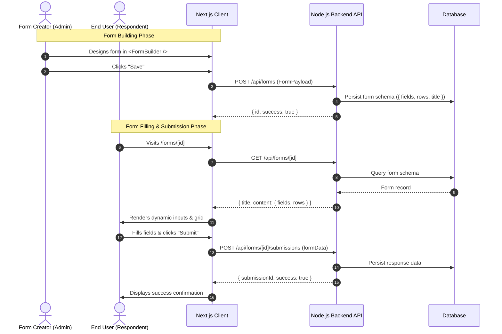

# Frontend Implementation Guide: Next.js + dynamic-form-builder-kit

This guide provides a clean, production-grade, step-by-step walkthrough for implementing dynamic form creation, editing, rendering, and response submission in **Next.js (App Router)** using **`dynamic-form-builder-kit`** and **`shadcn/ui`**.

---

## 📑 Table of Contents

1. [Architecture & Data Flow](#1-architecture--data-flow)
2. [Step 1: Next.js & shadcn/ui Project Setup](#step-1-nextjs--shadcnui-project-setup)
3. [Step 2: Add dynamic-form-builder-kit to Your Project](#step-2-add-dynamic-form-builder-kit-to-your-project)
4. [Step 3: API Client Service (`lib/api.ts`)](#step-3-api-client-service-libapits)
5. [Step 4: Form Builder Page (`app/forms/builder/page.tsx`)](#step-4-form-builder-page-appformsbuilderpagetsx)
6. [Step 5: Public Dynamic Form Renderer (`app/forms/[id]/page.tsx`)](#step-5-public-dynamic-form-renderer-appformsidpagetsx)
7. [Step 6: Forms Dashboard (`app/forms/page.tsx`)](#step-6-forms-dashboard-appformspagetsx)
8. [Step 7: Form Submissions Viewer (`app/forms/[id]/submissions/page.tsx`)](#step-7-form-submissions-viewer-appformsidsubmissionspagetsx)
9. [Step 8: End-to-End Verification](#step-8-end-to-end-verification)
10. [Troubleshooting & FAQs](#troubleshooting--faqs)

---

## 1. Architecture & Data Flow



---

## Step 1: Next.js & shadcn/ui Project Setup

If you already have a Next.js project with `shadcn/ui`, skip to [Step 2](#step-2-add-dynamic-form-builder-kit-to-your-project).

### 1.1 Create a Next.js App
```bash
npx create-next-app@latest my-form-app \
  --typescript \
  --tailwind \
  --eslint \
  --app \
  --src-dir \
  --import-alias "@/*" \
  --use-npm \
  --yes

cd my-form-app
```

### 1.2 Initialize shadcn/ui
```bash
npx shadcn@latest init --defaults --yes
```

### 1.3 Install Required Dependencies
```bash
npm install lucide-react
npx shadcn@latest add button input tabs card label checkbox dropdown-menu select textarea radio-group slider switch --yes
```

---

## Step 2: Add dynamic-form-builder-kit to Your Project

You have two easy ways to add the builder components into your app:

### Option A: Using the CLI (Recommended)
```bash
npx dynamic-form-builder-kit add --yes
```
*Or if using the short alias:*
```bash
npx dfb add --yes
```

### Option B: Using shadcn Registry Directly
```bash
npx shadcn add https://raw.githubusercontent.com/Sandezh/dynamic-form-builder/main/registry/form-builder.json --yes
```

### Verified Directory Structure
After running either command, your project will have the self-contained component kit in `@/components/form-builder`:
```
src/
├── components/
│   ├── form-builder/
│   │   ├── index.ts              # Exports FormBuilder, FormPreview, types, utils
│   │   ├── FormBuilder.tsx       # Three-panel drag-and-drop form designer
│   │   ├── FormCanvas.tsx        # Canvas & row-column layout inspector
│   │   ├── FieldPalette.tsx      # Field presets and templates sidebar
│   │   ├── FormPreview.tsx       # Live preview card
│   │   └── form-builder.data.ts  # Default field specifications
│   └── ui/                       # shadcn/ui base primitives
├── types/
│   └── form-builder.types.ts     # TypeScript interfaces (FormField, FormRow, FormPayload)
└── lib/
    └── form-builder-utils.ts     # Slugification and naming helpers
```

---

## Step 3: API Client Service (`lib/api.ts`)

Create a centralized API client module to communicate with your Node.js backend.

Create **`src/lib/api.ts`**:

```typescript
import type { FormPayload, FormContent } from '@/types/form-builder.types';

const API_BASE = process.env.NEXT_PUBLIC_API_URL || 'http://localhost:5000/api';

export interface FormItem {
  id: string;
  title: string;
  content: FormContent;
  createdAt: string;
  updatedAt: string;
  submissionCount?: number;
}

export interface FormSubmission {
  id: string;
  formId: string;
  data: Record<string, unknown>;
  createdAt: string;
}

export const api = {
  /**
   * Fetch all forms
   */
  async getForms(): Promise<FormItem[]> {
    const res = await fetch(`${API_BASE}/forms`, { cache: 'no-store' });
    if (!res.ok) throw new Error(`Failed to fetch forms (${res.status})`);
    return res.json();
  },

  /**
   * Fetch a single form by ID
   */
  async getForm(id: string): Promise<FormItem> {
    const res = await fetch(`${API_BASE}/forms/${id}`, { cache: 'no-store' });
    if (!res.ok) throw new Error(`Failed to fetch form ${id} (${res.status})`);
    return res.json();
  },

  /**
   * Create a new form
   */
  async createForm(payload: FormPayload): Promise<FormItem> {
    const res = await fetch(`${API_BASE}/forms`, {
      method: 'POST',
      headers: { 'Content-Type': 'application/json' },
      body: JSON.stringify(payload),
    });
    if (!res.ok) {
      const err = await res.json().catch(() => ({}));
      throw new Error(err.message || 'Failed to create form');
    }
    return res.json();
  },

  /**
   * Update an existing form
   */
  async updateForm(id: string, payload: FormPayload): Promise<FormItem> {
    const res = await fetch(`${API_BASE}/forms/${id}`, {
      method: 'PUT',
      headers: { 'Content-Type': 'application/json' },
      body: JSON.stringify(payload),
    });
    if (!res.ok) {
      const err = await res.json().catch(() => ({}));
      throw new Error(err.message || 'Failed to update form');
    }
    return res.json();
  },

  /**
   * Delete a form
   */
  async deleteForm(id: string): Promise<void> {
    const res = await fetch(`${API_BASE}/forms/${id}`, { method: 'DELETE' });
    if (!res.ok) throw new Error('Failed to delete form');
  },

  /**
   * Submit an end-user response for a form
   */
  async submitResponse(formId: string, data: Record<string, unknown>): Promise<{ id: string }> {
    const res = await fetch(`${API_BASE}/forms/${formId}/submissions`, {
      method: 'POST',
      headers: { 'Content-Type': 'application/json' },
      body: JSON.stringify(data),
    });
    if (!res.ok) {
      const err = await res.json().catch(() => ({}));
      throw new Error(err.message || 'Failed to submit form');
    }
    return res.json();
  },

  /**
   * Get all submissions for a form
   */
  async getSubmissions(formId: string): Promise<FormSubmission[]> {
    const res = await fetch(`${API_BASE}/forms/${formId}/submissions`, { cache: 'no-store' });
    if (!res.ok) throw new Error('Failed to fetch submissions');
    return res.json();
  },
};
```

Add your backend URL to **`.env.local`**:
```env
NEXT_PUBLIC_API_URL=http://localhost:5000/api
```

---

## Step 4: Form Builder Page (`app/forms/builder/page.tsx`)

This page hosts the `<FormBuilder />` component. It supports both **creating a new form** and **editing an existing form** (via `?id=FORM_ID` query param).

Create **`src/app/forms/builder/page.tsx`**:

```tsx
'use client';

import { Suspense, useEffect, useState } from 'react';
import { useRouter, useSearchParams } from 'next/navigation';
import Link from 'next/link';
import { ArrowLeft, Loader2 } from 'lucide-react';
import { FormBuilder, type FormPayload, type FormContent } from '@/components/form-builder';
import { Button } from '@/components/ui/button';
import { api } from '@/lib/api';

function FormBuilderContent() {
  const router = useRouter();
  const searchParams = useSearchParams();
  const formId = searchParams.get('id');

  const [loading, setLoading] = useState<boolean>(Boolean(formId));
  const [initialTitle, setInitialTitle] = useState<string>('Untitled Form');
  const [initialContent, setInitialContent] = useState<FormContent | undefined>(undefined);
  const [saveSuccessId, setSaveSuccessId] = useState<string | null>(null);

  // Load existing form data if an ID was passed in the query params
  useEffect(() => {
    if (!formId) return;

    let mounted = true;
    setLoading(true);

    api.getForm(formId)
      .then((data) => {
        if (!mounted) return;
        setInitialTitle(data.title);
        setInitialContent(data.content);
      })
      .catch((err) => {
        console.error('Failed to load form:', err);
        alert('Could not load form for editing.');
      })
      .finally(() => {
        if (mounted) setLoading(false);
      });

    return () => {
      mounted = false;
    };
  }, [formId]);

  // Handle saving to the Node.js backend
  const handleSave = async (payload: FormPayload) => {
    if (formId) {
      // Update existing form
      await api.updateForm(formId, payload);
      setSaveSuccessId(formId);
    } else {
      // Create new form
      const created = await api.createForm(payload);
      setSaveSuccessId(created.id);
      // Update URL query without full reload
      router.replace(`/forms/builder?id=${created.id}`);
    }
  };

  if (loading) {
    return (
      <div className="flex h-screen items-center justify-center gap-2">
        <Loader2 className="h-6 w-6 animate-spin text-muted-foreground" />
        <span className="text-sm text-muted-foreground">Loading form schema...</span>
      </div>
    );
  }

  return (
    <div className="flex flex-col h-screen overflow-hidden bg-background">
      {/* Top Navigation Bar */}
      <header className="flex h-12 items-center justify-between border-b px-4 bg-card shrink-0">
        <div className="flex items-center gap-3">
          <Button variant="ghost" size="sm" asChild>
            <Link href="/forms" className="gap-1.5 text-xs">
              <ArrowLeft className="h-3.5 w-3.5" />
              All Forms
            </Link>
          </Button>
          <span className="text-xs text-muted-foreground">/</span>
          <span className="text-xs font-medium">
            {formId ? 'Editing Form' : 'New Form Builder'}
          </span>
        </div>

        {saveSuccessId && (
          <div className="flex items-center gap-2">
            <span className="text-xs text-green-600 font-medium">Saved!</span>
            <Button size="sm" variant="outline" asChild>
              <Link href={`/forms/${saveSuccessId}`} target="_blank">
                Open Public Form ↗
              </Link>
            </Button>
          </div>
        )}
      </header>

      {/* Main FormBuilder Workspace */}
      <main className="flex-1 min-h-0">
        <FormBuilder
          key={formId || 'new'}
          initialTitle={initialTitle}
          initialContent={initialContent}
          refKey={formId || undefined}
          onSave={handleSave}
        />
      </main>
    </div>
  );
}

export default function BuilderPage() {
  return (
    <Suspense fallback={<div className="p-8">Loading builder...</div>}>
      <FormBuilderContent />
    </Suspense>
  );
}
```

---

## Step 5: Public Dynamic Form Renderer (`app/forms/[id]/page.tsx`)

This is the end-user facing page where respondents fill out and submit the form. It reads the form schema from the Node.js backend and dynamically renders the appropriate UI components with layout rows and validation.

Create **`src/app/forms/[id]/page.tsx`**:

```tsx
'use client';

import React, { useEffect, useState } from 'react';
import { useParams } from 'next/navigation';
import { api, type FormItem } from '@/lib/api';
import type { FormContentField } from '@/types/form-builder.types';
import { Button } from '@/components/ui/button';
import { Input } from '@/components/ui/input';
import { Label } from '@/components/ui/label';
import { Textarea } from '@/components/ui/textarea';
import { Checkbox } from '@/components/ui/checkbox';
import { Switch } from '@/components/ui/switch';
import { Slider } from '@/components/ui/slider';
import { RadioGroup, RadioGroupItem } from '@/components/ui/radio-group';
import {
  Select,
  SelectContent,
  SelectItem,
  SelectTrigger,
  SelectValue,
} from '@/components/ui/select';
import { Card, CardContent, CardDescription, CardHeader, CardTitle } from '@/components/ui/card';
import { CheckCircle2, Loader2, AlertCircle } from 'lucide-react';

export default function PublicFormPage() {
  const params = useParams();
  const formId = params.id as string;

  const [form, setForm] = useState<FormItem | null>(null);
  const [loading, setLoading] = useState<boolean>(true);
  const [error, setError] = useState<string | null>(null);

  // Form values state
  const [formData, setFormData] = useState<Record<string, any>>({});
  const [submitting, setSubmitting] = useState<boolean>(false);
  const [submitted, setSubmitted] = useState<boolean>(false);

  useEffect(() => {
    if (!formId) return;

    api.getForm(formId)
      .then((data) => {
        setForm(data);
        // Initialize default empty values
        const initial: Record<string, any> = {};
        data.content.fields.forEach((f) => {
          const key = f.name || f.id;
          if (f.type === 'checkbox' || f.type === 'toggle') initial[key] = false;
          else if (f.type === 'multiselect') initial[key] = [];
          else if (f.type === 'slider') initial[key] = f.minValue ?? 0;
          else initial[key] = '';
        });
        setFormData(initial);
      })
      .catch((err) => {
        setError(err.message || 'Form not found');
      })
      .finally(() => setLoading(false));
  }, [formId]);

  const handleChange = (name: string, value: any) => {
    setFormData((prev) => ({ ...prev, [name]: value }));
  };

  const handleSubmit = async (e: React.FormEvent) => {
    e.preventDefault();
    setSubmitting(true);
    setError(null);

    try {
      await api.submitResponse(formId, formData);
      setSubmitted(true);
    } catch (err: any) {
      setError(err.message || 'Failed to submit response');
    } finally {
      setSubmitting(false);
    }
  };

  if (loading) {
    return (
      <div className="min-h-screen flex items-center justify-center bg-muted/20">
        <div className="flex items-center gap-2 text-muted-foreground">
          <Loader2 className="h-5 w-5 animate-spin" />
          <span>Loading form...</span>
        </div>
      </div>
    );
  }

  if (error && !form) {
    return (
      <div className="min-h-screen flex items-center justify-center p-4 bg-muted/20">
        <Card className="max-w-md w-full">
          <CardHeader>
            <div className="flex items-center gap-2 text-destructive">
              <AlertCircle className="h-5 w-5" />
              <CardTitle>Error Loading Form</CardTitle>
            </div>
            <CardDescription>{error}</CardDescription>
          </CardHeader>
        </Card>
      </div>
    );
  }

  if (submitted) {
    return (
      <div className="min-h-screen flex items-center justify-center p-4 bg-muted/20">
        <Card className="max-w-md w-full text-center py-8">
          <CardContent className="space-y-4">
            <CheckCircle2 className="h-12 w-12 text-green-500 mx-auto" />
            <h2 className="text-xl font-bold">Thank You!</h2>
            <p className="text-sm text-muted-foreground">
              Your response for <strong>{form?.title}</strong> has been submitted successfully.
            </p>
            <Button
              variant="outline"
              onClick={() => {
                setSubmitted(false);
                setFormData({});
              }}
            >
              Submit Another Response
            </Button>
          </CardContent>
        </Card>
      </div>
    );
  }

  if (!form) return null;

  const { title, content } = form;

  // Helper to render individual dynamic fields
  const renderField = (field: FormContentField) => {
    const key = field.name || field.id;
    const value = formData[key] ?? '';

    switch (field.type) {
      case 'header':
        return <h3 className="text-lg font-semibold mt-2">{field.label}</h3>;

      case 'paragraph':
        return <p className="text-sm text-muted-foreground">{field.placeholder || field.label}</p>;

      case 'textarea':
        return (
          <div className="space-y-1.5">
            <Label htmlFor={field.id}>
              {field.label} {field.required && <span className="text-destructive">*</span>}
            </Label>
            <Textarea
              id={field.id}
              required={field.required}
              placeholder={field.placeholder}
              rows={field.rows || 3}
              value={value}
              onChange={(e) => handleChange(key, e.target.value)}
            />
            {field.helpText && <p className="text-xs text-muted-foreground">{field.helpText}</p>}
          </div>
        );

      case 'select':
        return (
          <div className="space-y-1.5">
            <Label htmlFor={field.id}>
              {field.label} {field.required && <span className="text-destructive">*</span>}
            </Label>
            <Select value={value} onValueChange={(val) => handleChange(key, val)}>
              <SelectTrigger id={field.id}>
                <SelectValue placeholder={field.placeholder || 'Select an option'} />
              </SelectTrigger>
              <SelectContent>
                {(field.options || []).map((opt) => (
                  <SelectItem key={opt} value={opt}>
                    {opt}
                  </SelectItem>
                ))}
              </SelectContent>
            </Select>
            {field.helpText && <p className="text-xs text-muted-foreground">{field.helpText}</p>}
          </div>
        );

      case 'radio':
        return (
          <div className="space-y-2">
            <Label>
              {field.label} {field.required && <span className="text-destructive">*</span>}
            </Label>
            <RadioGroup
              value={value}
              onValueChange={(val) => handleChange(key, val)}
              className={field.orientation === 'horizontal' ? 'flex flex-wrap gap-4' : 'space-y-1.5'}
            >
              {(field.options || []).map((opt) => (
                <div key={opt} className="flex items-center space-x-2">
                  <RadioGroupItem value={opt} id={`${field.id}-${opt}`} />
                  <Label htmlFor={`${field.id}-${opt}`} className="font-normal cursor-pointer">
                    {opt}
                  </Label>
                </div>
              ))}
            </RadioGroup>
            {field.helpText && <p className="text-xs text-muted-foreground">{field.helpText}</p>}
          </div>
        );

      case 'checkbox':
        return (
          <div className="flex items-start space-x-2 pt-2">
            <Checkbox
              id={field.id}
              checked={Boolean(value)}
              onCheckedChange={(checked) => handleChange(key, Boolean(checked))}
            />
            <div className="grid gap-1.5 leading-none">
              <Label htmlFor={field.id} className="cursor-pointer">
                {field.label} {field.required && <span className="text-destructive">*</span>}
              </Label>
              {field.helpText && <p className="text-xs text-muted-foreground">{field.helpText}</p>}
            </div>
          </div>
        );

      case 'toggle':
        return (
          <div className="flex items-center justify-between py-2">
            <div className="space-y-0.5">
              <Label htmlFor={field.id} className="cursor-pointer">
                {field.label} {field.required && <span className="text-destructive">*</span>}
              </Label>
              {field.helpText && <p className="text-xs text-muted-foreground">{field.helpText}</p>}
            </div>
            <Switch
              id={field.id}
              checked={Boolean(value)}
              onCheckedChange={(checked) => handleChange(key, checked)}
            />
          </div>
        );

      case 'slider':
        return (
          <div className="space-y-2">
            <div className="flex justify-between items-center">
              <Label htmlFor={field.id}>
                {field.label} {field.required && <span className="text-destructive">*</span>}
              </Label>
              <span className="text-xs font-mono font-medium text-muted-foreground">
                {value || field.minValue || 0}
              </span>
            </div>
            <Slider
              id={field.id}
              min={field.minValue ?? 0}
              max={field.maxValue ?? 100}
              step={field.step ?? 1}
              value={[Number(value) || field.minValue || 0]}
              onValueChange={(val) => handleChange(key, val[0])}
            />
            {field.helpText && <p className="text-xs text-muted-foreground">{field.helpText}</p>}
          </div>
        );

      default:
        // text, email, number, date, time, tel, url, password
        return (
          <div className="space-y-1.5">
            <Label htmlFor={field.id}>
              {field.label} {field.required && <span className="text-destructive">*</span>}
            </Label>
            <Input
              id={field.id}
              type={field.type || 'text'}
              required={field.required}
              placeholder={field.placeholder}
              value={value}
              onChange={(e) => handleChange(key, e.target.value)}
            />
            {field.helpText && <p className="text-xs text-muted-foreground">{field.helpText}</p>}
          </div>
        );
    }
  };

  return (
    <div className="min-h-screen py-10 px-4 bg-muted/20">
      <div className="max-w-2xl mx-auto">
        <Card className="shadow-sm">
          <CardHeader className="border-b pb-4">
            <CardTitle className="text-2xl">{title || 'Untitled Form'}</CardTitle>
            <CardDescription>Please complete the fields below.</CardDescription>
          </CardHeader>
          <CardContent className="pt-6">
            <form onSubmit={handleSubmit} className="space-y-5">
              {error && (
                <div className="p-3 text-sm text-destructive bg-destructive/10 rounded-md">
                  {error}
                </div>
              )}

              {/* Render rows and columns */}
              {content.rows.map((row) => {
                const rowFields = row.fields
                  .map((fieldId) => content.fields.find((f) => f.id === fieldId))
                  .filter((f): f is FormContentField => f !== undefined);

                return (
                  <div key={row.id} className="grid grid-cols-12 gap-4">
                    {rowFields.map((field) => {
                      let colSpan = 'col-span-12';
                      if (field.columnWidth === 'half') colSpan = 'col-span-12 md:col-span-6';
                      else if (field.columnWidth === 'third') colSpan = 'col-span-12 md:col-span-4';
                      else if (field.columnWidth === 'quarter') colSpan = 'col-span-12 md:col-span-3';

                      return (
                        <div key={field.id} className={colSpan}>
                          {renderField(field)}
                        </div>
                      );
                    })}
                  </div>
                );
              })}

              <div className="pt-4 border-t flex justify-end">
                <Button type="submit" disabled={submitting} className="min-w-[120px]">
                  {submitting ? (
                    <>
                      <Loader2 className="mr-2 h-4 w-4 animate-spin" />
                      Submitting...
                    </>
                  ) : (
                    'Submit'
                  )}
                </Button>
              </div>
            </form>
          </CardContent>
        </Card>
      </div>
    </div>
  );
}
```

---

## Step 6: Forms Dashboard (`app/forms/page.tsx`)

This page gives your administrators a dashboard showing all created forms with options to create a new form, edit an existing form in the builder, view the public form link, and inspect submissions.

Create **`src/app/forms/page.tsx`**:

```tsx
'use client';

import { useEffect, useState } from 'react';
import Link from 'next/link';
import { Button } from '@/components/ui/button';
import { Card, CardContent, CardDescription, CardHeader, CardTitle } from '@/components/ui/card';
import { Plus, Edit, ExternalLink, Inbox, Trash2, Loader2 } from 'lucide-react';
import { api, type FormItem } from '@/lib/api';

export default function FormsDashboardPage() {
  const [forms, setForms] = useState<FormItem[]>([]);
  const [loading, setLoading] = useState<boolean>(true);
  const [error, setError] = useState<string | null>(null);

  const fetchForms = () => {
    setLoading(true);
    api.getForms()
      .then(setForms)
      .catch((err) => setError(err.message))
      .finally(() => setLoading(false));
  };

  useEffect(() => {
    fetchForms();
  }, []);

  const handleDelete = async (id: string) => {
    if (!confirm('Are you sure you want to delete this form?')) return;
    try {
      await api.deleteForm(id);
      setForms((prev) => prev.filter((f) => f.id !== id));
    } catch (err: any) {
      alert(err.message || 'Failed to delete form');
    }
  };

  return (
    <div className="max-w-5xl mx-auto py-10 px-4">
      <div className="flex items-center justify-between mb-8">
        <div>
          <h1 className="text-3xl font-bold tracking-tight">Forms</h1>
          <p className="text-muted-foreground text-sm mt-1">
            Build, edit, and view dynamic forms and their incoming submissions.
          </p>
        </div>
        <Button asChild>
          <Link href="/forms/builder" className="gap-2">
            <Plus className="h-4 w-4" />
            Create Form
          </Link>
        </Button>
      </div>

      {loading ? (
        <div className="flex justify-center py-20 text-muted-foreground">
          <Loader2 className="h-6 w-6 animate-spin mr-2" />
          Loading forms...
        </div>
      ) : error ? (
        <div className="p-4 rounded-md bg-destructive/10 text-destructive text-sm">
          {error}
        </div>
      ) : forms.length === 0 ? (
        <Card className="text-center py-12">
          <CardContent className="space-y-3">
            <p className="text-muted-foreground">No forms created yet.</p>
            <Button asChild variant="outline">
              <Link href="/forms/builder">Build your first form</Link>
            </Button>
          </CardContent>
        </Card>
      ) : (
        <div className="grid grid-cols-1 md:grid-cols-2 gap-4">
          {forms.map((form) => (
            <Card key={form.id} className="flex flex-col justify-between hover:shadow-md transition">
              <CardHeader className="pb-3">
                <CardTitle className="text-lg">{form.title || 'Untitled Form'}</CardTitle>
                <CardDescription className="text-xs">
                  {form.content?.fields?.length || 0} fields • Created {new Date(form.createdAt).toLocaleDateString()}
                </CardDescription>
              </CardHeader>
              <CardContent className="pt-0 flex items-center justify-between border-t py-3 bg-muted/10">
                <div className="flex items-center gap-2">
                  <Button size="sm" variant="outline" asChild>
                    <Link href={`/forms/builder?id=${form.id}`} className="gap-1.5 text-xs">
                      <Edit className="h-3.5 w-3.5" />
                      Edit
                    </Link>
                  </Button>
                  <Button size="sm" variant="outline" asChild>
                    <Link href={`/forms/${form.id}`} target="_blank" className="gap-1.5 text-xs">
                      <ExternalLink className="h-3.5 w-3.5" />
                      View
                    </Link>
                  </Button>
                  <Button size="sm" variant="outline" asChild>
                    <Link href={`/forms/${form.id}/submissions`} className="gap-1.5 text-xs">
                      <Inbox className="h-3.5 w-3.5" />
                      Responses
                    </Link>
                  </Button>
                </div>
                <Button
                  size="icon"
                  variant="ghost"
                  className="text-muted-foreground hover:text-destructive h-8 w-8"
                  onClick={() => handleDelete(form.id)}
                >
                  <Trash2 className="h-4 w-4" />
                </Button>
              </CardContent>
            </Card>
          ))}
        </div>
      )}
    </div>
  );
}
```

---

## Step 7: Form Submissions Viewer (`app/forms/[id]/submissions/page.tsx`)

This page displays the responses submitted by respondents for a given form.

Create **`src/app/forms/[id]/submissions/page.tsx`**:

```tsx
'use client';

import { useEffect, useState } from 'react';
import { useParams } from 'next/navigation';
import Link from 'next/link';
import { ArrowLeft, Loader2 } from 'lucide-react';
import { Button } from '@/components/ui/button';
import { Card, CardContent, CardDescription, CardHeader, CardTitle } from '@/components/ui/card';
import { api, type FormItem, type FormSubmission } from '@/lib/api';

export default function SubmissionsPage() {
  const params = useParams();
  const formId = params.id as string;

  const [form, setForm] = useState<FormItem | null>(null);
  const [submissions, setSubmissions] = useState<FormSubmission[]>([]);
  const [loading, setLoading] = useState<boolean>(true);

  useEffect(() => {
    if (!formId) return;

    Promise.all([api.getForm(formId), api.getSubmissions(formId)])
      .then(([formData, subs]) => {
        setForm(formData);
        setSubmissions(subs);
      })
      .catch((err) => console.error(err))
      .finally(() => setLoading(false));
  }, [formId]);

  if (loading) {
    return (
      <div className="flex h-screen items-center justify-center">
        <Loader2 className="h-6 w-6 animate-spin text-muted-foreground" />
      </div>
    );
  }

  const fields = form?.content.fields || [];

  return (
    <div className="max-w-6xl mx-auto py-8 px-4">
      <div className="flex items-center gap-3 mb-6">
        <Button variant="ghost" size="sm" asChild>
          <Link href="/forms" className="gap-1.5 text-xs">
            <ArrowLeft className="h-4 w-4" />
            Back to Forms
          </Link>
        </Button>
        <span className="text-muted-foreground">/</span>
        <h1 className="text-xl font-bold">{form?.title} — Submissions</h1>
      </div>

      {submissions.length === 0 ? (
        <Card className="text-center py-12">
          <CardContent>
            <p className="text-muted-foreground">No submissions received yet.</p>
          </CardContent>
        </Card>
      ) : (
        <Card>
          <CardHeader>
            <CardTitle className="text-base">All Responses ({submissions.length})</CardTitle>
            <CardDescription>Submitted data from respondents.</CardDescription>
          </CardHeader>
          <CardContent className="overflow-x-auto">
            <table className="w-full text-sm border-collapse">
              <thead>
                <tr className="border-b bg-muted/30 text-left">
                  <th className="p-2.5 font-medium">Submitted At</th>
                  {fields.map((f) => (
                    <th key={f.id} className="p-2.5 font-medium">
                      {f.label}
                    </th>
                  ))}
                </tr>
              </thead>
              <tbody>
                {submissions.map((sub) => (
                  <tr key={sub.id} className="border-b hover:bg-muted/10">
                    <td className="p-2.5 whitespace-nowrap text-xs text-muted-foreground">
                      {new Date(sub.createdAt).toLocaleString()}
                    </td>
                    {fields.map((f) => {
                      const key = f.name || f.id;
                      const val = sub.data[key];
                      return (
                        <td key={f.id} className="p-2.5 whitespace-nowrap">
                          {val === true
                            ? 'Yes'
                            : val === false
                            ? 'No'
                            : Array.isArray(val)
                            ? val.join(', ')
                            : typeof val === 'object' && val !== null
                            ? JSON.stringify(val)
                            : String(val ?? '—')}
                        </td>
                      );
                    })}
                  </tr>
                ))}
              </tbody>
            </table>
          </CardContent>
        </Card>
      )}
    </div>
  );
}
```

---

## Step 8: End-to-End Verification

### 1. Start the Next.js Dev Server
```bash
npm run dev
```
Open **`http://localhost:3000/forms`** in your browser.

### 2. Test the Full Workflow
1. **Create Form**: Click **"Create Form"** to open `/forms/builder`.
2. **Design & Drag**: Drag fields from the palette (e.g. Full Name, Email, Dropdown Select, Rating, Checkbox), reorder them, adjust column widths.
3. **Save**: Click **"Save"** in the top header. The payload is sent to `POST /api/forms` on your Node.js backend.
4. **View Public Form**: Click **"Open Public Form"** to open `/forms/[id]`.
5. **Submit Response**: Fill out the fields and click **"Submit"**. The response is sent to `POST /api/forms/[id]/submissions`.
6. **Inspect Responses**: Go to `/forms/[id]/submissions` to verify that your submitted data appears in the table.

---

## Troubleshooting & FAQs

### Q: Module not found: Can't resolve `@/components/form-builder`?
Ensure your `tsconfig.json` contains:
```json
{
  "compilerOptions": {
    "baseUrl": ".",
    "paths": {
      "@/*": ["./src/*"]   // or ["./*"] if not using src/ directory
    }
  }
}
```

### Q: Hydration mismatch warning on first load?
The `<FormBuilder />` component includes `'use client'` and client-side mount guards. If you render it inside an App Router page, ensure the page file starts with `'use client';`.

### Q: CORS error when calling Node.js backend?
Ensure your Node.js backend has the `cors` package configured to allow `http://localhost:3000`. See [Backend Implementation Guide](./BACKEND_IMPLEMENTATION.md) for the exact setup.
